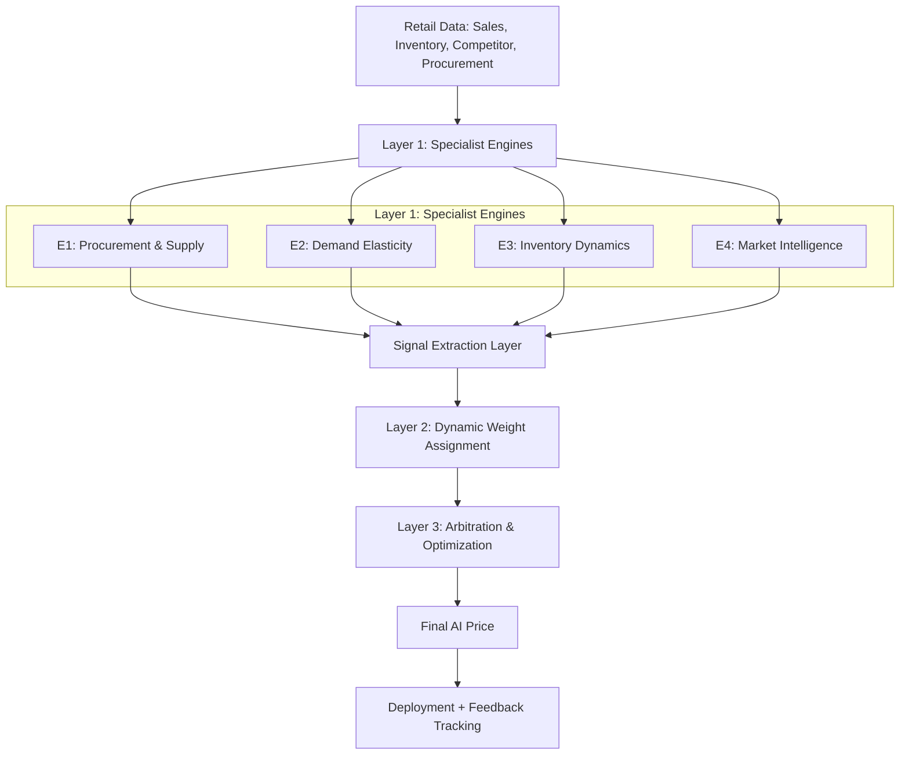

# Project Overview: Practical AI Dynamic Pricing System

This document outlines the goals, core design philosophy, high-level architecture, development strategy, and technology stack for the **Practical AI Dynamic Pricing System** based on the system design document.

---

## 1. Project Goal
The primary objective is to build an AI-powered pricing system that automatically recommends and deploys product prices for retail and e-commerce stores by:
*   Understanding consumer demand behavior.
*   Reacting dynamically to inventory conditions.
*   Tracking competitor pricing.
*   Protecting profit margins.
*   Learning continuously from historical business outcomes.

The system is designed to be **modular**, **scalable**, **explainable**, and **practically implementable**.

---

## 2. Core Design Philosophy
Instead of using a single monolithic neural network, the architecture separates pricing intelligence into specialized, independent components:

$$\text{Specialist Pricing Intelligence Engines (Layer 1)} \longrightarrow \text{Dynamic Weighting System (Layer 2)} \longrightarrow \text{Final Optimization Layer (Layer 3)}$$

This multi-layer approach makes the system easier to build, debug, scale, and improve incrementally.

---

## 3. High-Level Architecture
The system processes retail data through three layers to compute the final price:

### Layer 1: Specialist Engines
Each engine focuses on a single business domain:

| Engine | Name | Primary Input Signals | Primary Outputs | Implementation Detail |
| :--- | :--- | :--- | :--- | :--- |
| **E1** | **Procurement & Supply** | Supplier cost, freight, warehouse cost, taxes, currency rates | `minimum_safe_price`, `true_landed_cost`, `cost_volatility`, `supply_risk` | Primarily rule-based initially (landed cost + buffer + min margin). |
| **E2** | **Demand Elasticity** | Historical sales & prices, promotions, seasonality, customer segments | `optimal_price`, `elasticity_strength`, `demand_forecast` | Trained using **XGBoost** (avoid deep learning LSTMs initially). |
| **E3** | **Inventory Dynamics** | Stock quantity, reorder point, sales velocity, lead time, stock age | `inventory_pressure`, `stockout_risk`, `urgency_score` | High inventory triggers price decreases; low inventory triggers price increases. |
| **E4** | **Market Intelligence** | Competitor prices, promotions, ratings, region trends | `competitor_band`, `market_pressure`, `competitive_gap` | Monitors external competitor bands to protect competitiveness. |

### Signal Extraction Layer
Compresses the diverse outputs from Layer 1 into a standardized feature vector (e.g., `[minimum_safe_price, optimal_price, inventory_pressure, competitor_band]`) that serves as the input for Layer 2.

### Layer 2: Dynamic Weight Assignment (Meta-Learning)
*   **Purpose**: Predicts **weights (importance)** for each Layer 1 engine rather than predicting the final price directly.
*   **Inputs**: Engine signals + Retailer context (store type, business mode, category, region, customer segment).
*   **Model**: XGBoost is recommended for predicting dynamic weight values (e.g., `E1: 0.19, E2: 0.38, E3: 0.31, E4: 0.12`).

### Layer 3: Arbitration & Optimization
Generates and selects the highest-scoring candidate price based on:
1.  **Candidate Generation**: Candidates are generated around the elasticity optimum, competitor range, inventory pressure, and historical successful zones.
2.  **Scoring Logic**: Evaluates candidate prices against business constraints (min/max margins, maximum daily change limits) to optimize for revenue, margin quality, inventory safety, and competitiveness.

---

## 4. MVP Tech Stack
To avoid overengineering, the MVP will utilize:
*   **Backend**: Python + FastAPI
*   **Database**: PostgreSQL (for transaction data, datasets, and configurations)
*   **Caching/Queue**: Redis (for real-time pricing queries)
*   **Data Processing**: Pandas + NumPy
*   **Machine Learning**: XGBoost
*   **Deployment**: Docker

---

## 5. Development Roadmap
1.  **Step 1: Data Infrastructure**: Set up databases and define schemas for Products, Sales, Inventory, Procurement, Competitor, and Outcome datasets.
2.  **Step 2: Layer 1 Engines**: Build E1 (rule-based), E2 (XGBoost forecasting), E3 (inventory pressure rules), and E4 (competitor tracking).
3.  **Step 3: Signal Extraction**: Design the feature vector generation pipeline.
4.  **Step 4: Layer 2 Meta-Learning**: Build the weight prediction model.
5.  **Step 5: Layer 3 Optimization**: Implement arbitration workflow, candidate generation, and business rules/constraints.
6.  **Step 6: Deployment Pipeline**: Wrap the solution in a FastAPI application with the main endpoints (e.g., `POST /price/compute`).
7.  **Step 7: Reinforcement Learning (Later Stage)**: Introduce Contextual Bandits to optimize pricing decisions based on post-deployment rewards.
